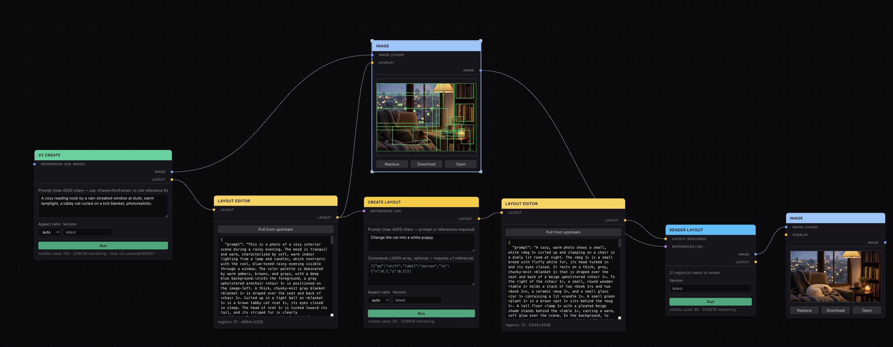

# Reve Nodes

An open-source, node-based workflow demo for [Reve](https://reve.com)'s public
REST API. Build image-generation pipelines visually — prompt in, image out,
with structured **layouts** (labeled regions) as a first-class, editable
intermediate representation.

Built with Next.js (App Router) + TypeScript + Tailwind + [`@xyflow/react`](https://reactflow.dev)
(React Flow v12). Inspired by an internal Reve prototype ("m3"), reimplemented
from scratch against the **public** REST API, with a much smaller node set and
no proprietary dependencies.

> This is a demo/reference implementation, not a production app. See
> [Deployment caveats](#deployment-caveats--limitations) before using it for
> anything beyond local exploration.

## What this is for

Reve's REST API exposes four v2 endpoints that compose into a small pipeline:
generate an image from a prompt (optionally with reference images), extract a
structured **layout** (a JSON description of labeled regions) from an image,
generate or edit a layout from a prompt/references/commands, and render a
final image from a layout. This app turns that pipeline into a visual,
inspectable, editable graph — you can look at (and hand-edit) the layout
between steps instead of treating the API as an opaque prompt-to-pixels box.

## Screenshot / architecture at a glance



The starter graph demonstrates the complete `V2 Create → Layout Editor →
Create Layout → Layout Editor → Render Layout` workflow, with the original
image feeding both a preview/overlay node and the final render as a reference.
The high-level architecture:

```
Browser (React Flow graph)
  │  node data holds only small {id, mediaType} image *references*,
  │  never raw image bytes — see "Image & reference storage" below
  ▼
Next.js API routes (src/app/api/reve/*, src/app/api/blobs/*)
  │  attach Authorization: Bearer REVE_API_KEY server-side
  │  hydrate blobId → base64 before calling Reve; persist base64 → blobId
  │  after calling Reve — the browser never sees the API key or raw bytes
  ▼
https://api.reve.com/v2/image/{create, extract_layout, create_layout, render_layout}
```

## Prerequisites

- Node.js 20+ and npm.
- A Reve API key from the [Reve console](https://api.reve.com/console) (Settings → API Keys).
- Reve credits/budget on your account — every generation call (including
  content-policy-rejected ones, per Reve's docs) consumes credits.

## Setup

```bash
cd nodes
npm install
cp .env.example .env.local
# edit .env.local and set REVE_API_KEY=<your key>
npm run dev
```

Open http://localhost:3000. The app loads with a small starter workflow (see
[Example workflows](#example-workflows)) that's ready to run once your key is
set.

### npm commands

| Command | What it does |
| --- | --- |
| `npm run dev` | Start the local dev server. |
| `npm run build` | Production build (also type-checks). |
| `npm run start` | Serve the production build. |
| `npm run lint` | ESLint (Next.js core-web-vitals config). |
| `npm run typecheck` | `tsc --noEmit`. |
| `npm run test` | Run the unit test suite (Vitest). |
| `npm run test:watch` | Unit tests in watch mode. |

## Node reference

All seven nodes are typed-handle React Flow nodes. Blue ports carry an
**image** reference, amber ports carry a **layout**, and purple "references"
ports accept either (see [Multi-reference ordering](#multi-reference-ordering-deterministic-multi-input-rule)).
Every node that calls the Reve API has its own **Run** button, a **Cancel**
button while in flight, and surfaces Reve's `request_id`/credits/version
metadata plus any structured error.

| Node | Endpoint | Inputs | Outputs | Notes |
| --- | --- | --- | --- | --- |
| **V2 Create** | `POST /v2/image/create` | `references` (multi, image-only, ≤8) | `image`, `layout` | Prompt required (≤4000 chars, supports `<frame>N</frame>` citations). Full v2 aspect-ratio set, default `auto`. Version defaults to `latest`. |
| **Extract Layout** | `POST /v2/image/extract_layout` | `image` (exactly one) | `layout` | Optional prompt to bias the extraction. |
| **Create Layout** | `POST /v2/image/create_layout` | `references` (multi, image **and/or** layout, ≤8) | `layout` | Prompt and/or references required. Optional `commands` as a raw JSON array (see below) — requires ≥1 reference. |
| **Render Layout** | `POST /v2/image/render_layout` | `layout` (required, exactly one), `references` (multi) | `image`, `layout` | Renders the connected layout; references (if any) guide the render. |
| **Layout Editor** | *(none — pure client)* | `layout` | `layout` | Raw JSON textarea with file upload/drop and JSON download. Auto-syncs from the connected upstream layout until you start typing; a "Pull upstream" button resyncs. Imported/edited JSON is schema-validated before it can flow downstream. |
| **Image Editor** | *(none — pure client)* | `image`, `layout` (optional, to load existing regions) | `layout`, `image` (passthrough) | Draw a region by dragging on the image; drag a corner handle to resize; drag inside a region to move it; edit label/prompt in the side panel; delete regions. No auto-caption — this demo has no AI vision dependency here. |
| **Image** | *(none — client upload/blob-store)* | `image` (optional passthrough, for chaining), `layout` (optional, overlay-only) | `image` | Click, drag-drop, or paste an image; use Replace to upload another. Download/Open buttons use the original bytes. |

### File import and export

You can create populated nodes directly from files:

- Drop a PNG, JPEG, WebP, GIF, TIFF, or AVIF anywhere on the canvas to create
  an **Image** node at that exact point and upload the image through the
  magic-byte-validated blob route. Dropping onto an existing Image node
  replaces that node's upload instead of creating a duplicate.
- Drop a `.json` file containing a valid Reve layout anywhere on the canvas
  to create a populated **Layout Editor** at that point. Layout files are
  capped at 1MB and validated with the same Zod schema used by API requests.
  Invalid JSON stays visible as an editable draft, but never replaces the
  node's last valid downstream output.
- **Upload JSON** and file drop replace a Layout Editor's local draft.
  **Download** saves its current valid layout as formatted JSON. Embedded
  previews publish a random-keyed, five-minute payload to the local server,
  then open a handoff page that fetches it over HTTP so Chrome storage
  partitioning cannot separate the iframe from its popup. The handoff invokes
  Chrome's native save picker; a copy-JSON fallback is provided when the
  picker is unavailable.

Multiple files dropped together are staggered by 40px so every created node
remains reachable.

### Create Layout commands

The `commands` field accepts Reve's small imperative edit language
(`add` / `place` / `shift` / `remove` / `keep` / `change` — see Reve's docs
for the exact per-op shapes). This demo exposes it as a raw JSON array
textarea rather than a visual command builder, e.g.:

```json
[{ "op": "shift", "label": "person", "to": { "x": 0.7, "y": 0.5 } }]
```

### Multi-reference ordering (deterministic multi-input rule)

`references`-style handles accept edges from multiple upstream nodes.
Reference order is **not** insertion order — it's the connected source
node's **canvas Y position, top to bottom** (ties broken by node id for
determinism). If a single upstream node is wired into the same `references`
handle via *both* its `image` and `layout` output ports, those two edges are
merged into **one compound reference** `{ image, layout }` rather than two
separate entries. This is implemented in `src/lib/referenceOrdering.ts` and
covered by `src/lib/referenceOrdering.test.ts`.

Practical implication: stack reference-image nodes vertically in the order
you want them cited (and remember `<frame>0</frame>` in a V2 Create prompt
refers to the topmost one).

## Example workflows

The app seeds the seven-node starter workflow shown above on first load (and
after "Reset workflow"):

```
V2 Create ──layout──▶ Layout Editor #1 ──references──▶ Create Layout
    │                         │                              │
    │                         └──overlay──▶ Image #1         └──layout──▶ Layout Editor #2
    └──image──▶ Image #1 ───────────────────────references──────────────────────┐
                                                                                ▼
                                                                        Render Layout ──image──▶ Image #2
```

The configured Create Layout prompt changes the original tabby cat into a
white puppy. Press **▶ Run all** to populate the graph end-to-end, or run
nodes individually to inspect each intermediate layout. Edit either Layout
Editor to experiment before continuing downstream. Other pipelines worth
trying:

- **Image → Extract Layout → Layout Editor → Render Layout**: turn an
  uploaded photo into an editable region description, tweak it, re-render.
- **Image → Image Editor → Render Layout**: hand-draw regions on an uploaded
  image (skipping Extract Layout entirely) and render from your own layout.
- **Two Image nodes → Create Layout (references) → Render Layout**: compose
  a new layout from two reference images plus a prompt, then render it.

## API endpoint mapping

| App node | Method | Path | Auth |
| --- | --- | --- | --- |
| V2 Create | `POST` | `/v2/image/create` | `Authorization: Bearer $REVE_API_KEY` (server-side only) |
| Extract Layout | `POST` | `/v2/image/extract_layout` | same |
| Create Layout | `POST` | `/v2/image/create_layout` | same |
| Render Layout | `POST` | `/v2/image/render_layout` | same |

Our own proxy routes live at `src/app/api/reve/{create,extract-layout,create-layout,render-layout}/route.ts`.
Each: validates the request with a `zod` schema (`src/lib/validation.ts`),
hydrates any `blobId` references into base64 bytes read from the local blob
store, calls Reve with `Accept: application/json`, persists any returned
base64 image back into the blob store, and returns a small JSON DTO
(`{ image?: {id, mediaType}, layout?, meta: {requestId, version,
contentViolation, creditsUsed, creditsRemaining} }`) to the browser — **never**
the raw base64. Non-2xx responses from Reve are forwarded faithfully: HTTP
status is preserved and the body becomes `{ error, errorCode, params }` where
`errorCode` is Reve's `error_code` (e.g. `PROMPT_TOO_LONG`,
`CONTENT_POLICY_VIOLATION`) and `params` is Reve's structured `params` object,
if present. A `content_violation: true` response is a **200** with no image —
the UI surfaces it as a distinct warning state, not a generic error.

Each route sets `export const maxDuration = 120` and forwards the incoming
request's `AbortSignal` to the upstream `fetch`, matching Reve's documented
guidance ("layout endpoints commonly take 10–40s, image endpoints 40–80s;
configure clients for ≥120s"). If you put this behind your own reverse proxy
or serverless platform, configure *its* timeout to ≥120s too, or long
generations will be cut off client-side while Reve keeps working server-side
(Reve's docs note the request may still complete even after your client gives
up).

## Security model

- `REVE_API_KEY` is read only via `process.env` inside `src/lib/reveClient.ts`,
  which is imported exclusively by server-only route handlers
  (`src/app/api/reve/**/route.ts`). It is never sent to the browser, never
  logged, and never included in any response body.
- `.env.local` is gitignored (see `.gitignore`); only `.env.example` (with a
  placeholder) is committed.
- Uploaded/generated image bytes never touch git either — `.reve-blobs/` is
  gitignored.
- Nothing in this repo logs request bodies, response bodies, or headers that
  could contain the key. `src/lib/apiError.ts`'s catch-all logs only a short
  error message for operator diagnostics.
- Image uploads are validated **by magic number** (`src/lib/imageSniff.ts`),
  not by the client-supplied `Content-Type`, and capped at 40MB — matching
  Reve's documented single-image limit. A file claiming to be a PNG that
  isn't one is rejected before it ever reaches disk or the Reve API.
- Imported layout JSON is capped at 1MB before `File.text()` and must pass
  `layoutSchema` before it becomes node output. Embedded layout downloads use
  a UUID-keyed, process-memory payload capped at 1MB and 32 concurrent entries,
  with a five-minute expiry and explicit deletion after save/close. The popup
  fetches that payload over a no-store API route, avoiding cross-site iframe
  `localStorage` partitioning; filenames are sanitized again server-side.
- Blob ids are validated as UUIDs before any filesystem read
  (`src/lib/blobStore.ts`), preventing path traversal via a crafted id.

## Image & reference storage

Node/graph state in the browser **only ever holds `{ id, mediaType }`
pointers** to images — never base64 or raw bytes. This is the same
indirection pattern the m3 prototype this app is inspired by uses, adapted
for the public REST API and simplified to local disk (no GCS):

- **Upload** (`POST /api/blobs`): accepts a `multipart/form-data` file field
  (the Image node's picker/drop/paste path) or `{ data: base64 }` JSON.
  Bytes are sniffed, size-checked, and written to `.reve-blobs/<uuid>.bin` +
  `.reve-blobs/<uuid>.json` (metadata).
- **Serve** (`GET /api/blobs/[id]`): streams the original bytes, or with
  `?w=<px>` returns a `sharp`-resized JPEG thumbnail (small in-memory LRU
  cache; falls back to the original on resize failure).
- **Hydrate/persist** (`src/lib/reveHydrate.ts`): right before a Reve call,
  `blobId` references are read from disk and inlined as base64
  (`{ data: "<base64>" }`); right after, any base64 image Reve returns is
  written to a fresh blob and replaced with `{ id, mediaType }` before the
  response reaches the browser.
- **Persistence** (`src/lib/persistence.ts`): the graph (nodes + edges) is
  saved to `localStorage` (not IndexedDB — deliberately; since node data
  never carries bytes, the serialized graph stays tiny regardless of how many
  or how large the images in the workflow are). "Reset workflow" clears it
  (with a confirmation) and reloads the starter example.

This is a **local-disk, single-instance, no-garbage-collection** store —
see the limitations below before deploying anywhere else.

## Deployment caveats & limitations

- **Local disk only, not safe for serverless/ephemeral filesystems or
  multiple instances.** `.reve-blobs/` is a plain directory on whatever
  filesystem the Next.js process runs on. On Vercel/most serverless
  platforms, or with more than one instance behind a load balancer, blobs
  written by one request may not be visible to a later request. This app is
  intended for local/single-instance demo use; a real deployment needs an
  object store (S3/GCS/R2) behind the same `saveBlob`/`readBlob` interface.
- **Process-local layout-download handoffs.** The short-lived download payload
  map is intentionally in-memory for this single-instance demo. A multi-instance
  deployment should replace `layoutDownloadStore.ts` with shared KV/storage so
  the popup's GET can reach payloads created by any instance.
- **No garbage collection.** Blobs accumulate on disk for the life of the
  checkout; there's no expiry or cleanup job. For a long-lived demo instance,
  periodically clear `.reve-blobs/`.
- **No auth/rate-limiting of your own.** Anyone who can reach the app can
  spend your Reve credits. Fine for local use; put it behind your own auth
  if you expose it.
- **No postprocessing UI.** Reve's `postprocessing` field (upscale, remove
  background, fit image, effects) is wired through the DTO/validation layer
  but has no control in the node UI, to keep the demo's surface area small.
- **No duplicate-with-edges.** ⌘/Ctrl+D duplicates selected node(s) with a
  position offset but does not duplicate edges between them.
- **Run all timeout.** Each topological "wave" of the whole-graph Run has a
  2-minute timeout (matching the per-node API timeout budget); a genuinely
  slow/stuck node will surface as a timeout error in the toolbar rather than
  hanging forever.

## Project structure

```
nodes/
├── src/
│   ├── app/
│   │   ├── api/
│   │   │   ├── reve/{create,extract-layout,create-layout,render-layout}/route.ts
│   │   │   ├── blobs/{route.ts, [id]/route.ts}
│   │   │   └── layout-downloads/{route.ts, [key]/route.ts}
│   │   ├── download/{[id],layout/[key]}/page.tsx  # sandbox-safe save handoffs
│   │   ├── layout.tsx        # root layout; installs the itr8 preview bridge
│   │   └── page.tsx
│   ├── components/
│   │   ├── Canvas.tsx         # React Flow setup, connection rules, Run all, persistence
│   │   ├── Toolbar.tsx, Palette.tsx
│   │   ├── nodeShell.tsx      # shared node chrome + labeled multi-handle ports
│   │   └── nodes/             # the 7 node components + shared hooks
│   └── lib/
│       ├── types.ts           # domain types + wire DTOs
│       ├── validation.ts      # zod schemas (shared client+server)
│       ├── reveClient.ts, reveHydrate.ts   # server-only Reve API access
│       ├── blobStore.ts, imageSniff.ts     # server-only local blob store
│       ├── apiClient.ts, uploadBlob.ts, blobSrc.ts   # client-only helpers
│       ├── fileImports.ts, fileSave.ts, layoutDownload.ts  # file workflows
│       ├── layoutDownloadStore.ts  # bounded server-side handoff payloads
│       ├── graphOrder.ts, referenceOrdering.ts, connectionRules.ts  # pure graph logic
│       ├── layoutEditing.ts   # pure region-editing math
│       ├── nodeRegistry.ts, seedWorkflow.ts, persistence.ts
│       └── *.test.ts          # Vitest unit tests for the pure-logic modules above
├── itr8.md                    # itr8 review-bridge notes
├── itr8-tests/reve-nodes-demo.md   # manual E2E test matrix
├── .env.example
└── README.md                  # you are here
```

## Troubleshooting

- **"REVE_API_KEY is not set on the server"** — copy `.env.example` to
  `.env.local`, fill in your key, and restart `npm run dev` (env files are
  only read at process start).
- **A node's Run fails immediately with a validation error** — that's our
  own `zod` validation catching a malformed request *before* it reaches
  Reve (and before spending a credit). The error message names the
  offending field.
- **`sharp` fails to install** (native binary) — this only affects
  thumbnail generation (`GET /api/blobs/[id]?w=...`); the blob route falls
  back to serving the original bytes on any resize failure, so the app still
  works without a working `sharp` install. If install itself fails, consult
  [sharp's platform docs](https://sharp.pixelplumbing.com/install) for your
  OS/architecture.
- **Content policy violation** — Reve returned `content_violation: true`
  with no image. This is a normal API response (not a bug); the node
  surfaces it as a distinct amber warning rather than a red error.
- **Slow first Run** — layout endpoints commonly take 10–40s and image
  endpoints 40–80s per Reve's docs; the spinner/"Running…" state is expected
  to sit for a while. Use Cancel to abort client-side (Reve may still finish
  the request server-side per their docs).
## Contributing / license

This demo is part of the `reve-sdk` repository and is distributed under the
repository's [Creative Commons Attribution 4.0 International license](../LICENSE).
Contributions should keep the example focused and run
`npm run typecheck && npm run lint && npm run test && npm run build` before
submission.
